<div align="center">
 

 
```
███╗   ██╗███████╗████████╗███████╗██╗     ██╗██╗  ██╗
████╗  ██║██╔════╝╚══██╔══╝██╔════╝██║     ██║╚██╗██╔╝
██╔██╗ ██║█████╗     ██║   █████╗  ██║     ██║ ╚███╔╝ 
██║╚██╗██║██╔══╝     ██║   ██╔══╝  ██║     ██║ ██╔██╗ 
██║ ╚████║███████╗   ██║   ██║     ███████╗██║██╔╝ ██╗
╚═╝  ╚═══╝╚══════╝   ╚═╝   ╚═╝     ╚══════╝╚═╝╚═╝  ╚═╝
```
 
# 🔐 DevSecOps Pipeline on AWS EKS
 
### *From Code to Cloud — Secured, Automated, Observed*
 
<br/>
 


 
<br/>
 
> 👤 **Muhammad Moazzam Hafeez** &nbsp;·&nbsp; 🏛️ FAST NUCES, Islamabad &nbsp;·&nbsp; ☁️ Cloud Computing
 
<br/>
 
| CI/CD | Container | Orchestration | Security | Monitoring | GitOps |
|:---:|:---:|:---:|:---:|:---:|:---:|
| [](http://13.63.190.54:8080) | [](https://hub.docker.com/r/moazzam021/netflix) | [](https://aws.amazon.com/eks) | [](http://13.63.190.54:9000) | [](http://13.63.190.54:9090) | [](https://argo-cd.readthedocs.io) |
| Pipeline automation | Image registry | 2× t3.medium | SAST + SCA + CVE | Metrics collection | GitOps sync |
| `:8080` | `moazzam021/netflix` | `eu-north-1` | `:9000` | [](http://13.63.190.54:3000) | Watches manifests |
 
</div>
 
---
 
## 🎬 Project Video Walkthrough
 
> **[▶ Watch Full Project Demo on Google Drive](https://drive.google.com/file/d/1qQVecWZPRqlrs116aTCDlWq2_xT5DzME/view?usp=sharing)**
>
> *Complete end-to-end demonstration of the pipeline, security scans, Kubernetes deployment, and monitoring dashboards.*
 
---
 
## 📋 Table of Contents
 
- [Executive Summary](#-executive-summary)
- [Why This Project Matters](#-why-this-project-matters)
- [Architecture Overview](#-architecture-overview)
- [Tech Stack](#-tech-stack)
- [Phase-by-Phase Implementation](#-phase-by-phase-implementation)
  - [Phase 1: Infrastructure Setup](#phase-1-infrastructure-setup--aws-ec2)
  - [Phase 2: Containerization](#phase-2-containerization--docker)
  - [Phase 3: CI/CD Pipeline](#phase-3-cicd-pipeline--jenkins)
  - [Phase 4: Security Scanning](#phase-4-security-scanning--sonarqube-owasp-trivy)
  - [Phase 5: Monitoring](#phase-5-monitoring--prometheus--grafana)
  - [Phase 6: Kubernetes & GitOps](#phase-6-kubernetes--gitops--eks--argocd)
- [The War Stories](#-the-war-stories--challenges--solutions)
- [Deployment Evidence](#-deployment-evidence)
- [Final Results](#-final-results)
- [Conclusion](#-conclusion)
 
---
 
## 🎯 Executive Summary
 
> *Every commit triggers a fully automated pipeline — code analysis, vulnerability scanning, container hardening, Docker build, Kubernetes deployment, and real-time monitoring. Security is not a final checkpoint — it is woven into every stage.*
 
<div align="center">
 
| 🔍 Code Scanned | 🛡️ Dependencies Checked | 🐳 Image Hardened | ☸️ K8s Deployed | 📊 Monitored |
|:---:|:---:|:---:|:---:|:---:|
| 91 source files | 341,007 CVE records | Every Docker layer | 2 × t3.medium nodes | 4 targets · all UP |
| SonarQube SAST | OWASP Dep-Check | Trivy scanner | AWS EKS · eu-north-1 | Prometheus + Grafana |
 
</div>
 
---
 
## 💡 Why This Project Matters
 
Modern software teams face a fundamental tension: **speed vs. security**. Traditional approaches treat security as a final gate — slow, expensive, and too late to fix cheaply.
 
**DevSecOps shifts security left** — catching issues at the code level, not in production.
 
| ❌ Without DevSecOps | ✅ With This Pipeline |
|---|---|
| Manual security reviews | Automated SAST on every commit |
| Unknown dependency vulnerabilities | OWASP scans every library |
| Unscanned container images | Trivy scans every Docker layer |
| Manual deployments | GitOps via ArgoCD |
| No visibility into system health | Real-time Prometheus + Grafana |
---

## 🏗️ Architecture Overview

```
┌─────────────────────────────────────────────────────────────────────┐
│                        DEVELOPER WORKFLOW                           │
│                                                                     │
│   VS Code  ──►  GitHub Repo  ──►  Jenkins Pipeline                 │
│                                        │                            │
│              ┌─────────────────────────┼──────────────────────┐    │
│              │      SECURITY GATES     │                       │    │
│              │                         ▼                       │    │
│              │   ┌──────────┐    ┌──────────┐   ┌──────────┐  │    │
│              │   │SonarQube │    │  OWASP   │   │  Trivy   │  │    │
│              │   │Code Scan │    │Dep-Check │   │Img Scan  │  │    │
│              │   └──────────┘    └──────────┘   └──────────┘  │    │
│              └─────────────────────────┼──────────────────────┘    │
│                                        │                            │
│                                        ▼                            │
│                              ┌──────────────────┐                  │
│                              │    DockerHub      │                  │
│                              │  moazzam021/netflix│                 │
│                              └────────┬─────────┘                  │
│                                       │  (ArgoCD watches)          │
│                                       ▼                             │
│              ┌────────────────────────────────────────┐            │
│              │           AWS EKS CLUSTER              │            │
│              │   ┌──────────┐    ┌──────────────┐    │            │
│              │   │  Node 1  │    │    Node 2    │    │            │
│              │   │ t3.medium│    │  t3.medium   │    │            │
│              │   └──────────┘    └──────────────┘    │            │
│              │         Netflix App on Port 30007      │            │
│              └────────────────────────────────────────┘            │
│                                                                     │
│   ┌─────────────────────────────────────┐                          │
│   │         MONITORING STACK            │                          │
│   │  Prometheus ──► Grafana Dashboards  │                          │
│   │  Node Exporter ──► System Metrics   │                          │
│   └─────────────────────────────────────┘                          │
└─────────────────────────────────────────────────────────────────────┘
```

---


## 🛠️ Tech Stack

| Category | Technology | Purpose |
|---|---|---|
| **Cloud** | AWS EC2 (t2.large) | Application & CI/CD server |
| **Cloud** | AWS EKS | Managed Kubernetes cluster |
| **Cloud** | AWS IAM | Identity & access management |
| **Containerization** | Docker 28.2.2 | Application packaging |
| **Registry** | DockerHub | Container image storage |
| **CI/CD** | Jenkins 2.541.3 | Pipeline automation |
| **Code Quality** | SonarQube 9.9.8 | Static application security testing |
| **Dependency Security** | OWASP Dependency-Check 12.2 | CVE vulnerability scanning |
| **Container Security** | Trivy 0.69.3 | Image & filesystem scanning |
| **Orchestration** | Kubernetes 1.35 | Container orchestration |
| **GitOps** | ArgoCD 2.4.7 | Declarative deployments |
| **Package Manager** | Helm 3.x | Kubernetes application management |
| **Monitoring** | Prometheus 2.47.1 | Metrics collection |
| **Visualization** | Grafana 12.4.2 | Metrics dashboards |
| **Metrics Exporter** | Node Exporter 1.6.1 | System-level metrics |
| **Source Control** | GitHub | Code & manifest repository |
| **API Data** | TMDB API | Movie data for Netflix clone |

---

## 📦 Phase-by-Phase Implementation

### Phase 1: Infrastructure Setup — AWS EC2

**Goal:** Provision a stable, accessible cloud server to host all DevSecOps tools.

**What we did:**
- Launched an Ubuntu 22.04 LTS EC2 instance (upgraded from t3.small to **t2.large** — 2 vCPUs, 8GB RAM)
- Assigned an **Elastic IP** (`13.63.190.54`) to ensure a permanent public address
- Configured Security Groups to expose all required ports:
  - `22` — SSH, `8080` — Jenkins, `9000` — SonarQube
  - `8081` — Application, `9090` — Prometheus, `3000` — Grafana
  - `9100` — Node Exporter

**Key decision:** Using Elastic IP prevents URL changes on instance restart — critical for webhook configurations between Jenkins and SonarQube.

---

### Phase 2: Containerization — Docker

**Goal:** Package the Netflix clone into a reproducible, portable container.

**What we did:**
- Installed Docker 28.2.2 on EC2
- Obtained TMDB API key (required for movie data)
- Built Docker image passing API key as build argument:
```bash
docker build --build-arg TMDB_V3_API_KEY=<key> -t netflix .
docker run -d --name netflix -p 8081:80 netflix:latest
```
- Verified app running locally at `localhost:8081` with movies loading ✅
- Created DockerHub repository `moazzam021/netflix` for image storage

**Why containerization matters:** The same Docker image that runs on the developer's laptop runs in production on Kubernetes — eliminating environment-specific bugs.

---

### Phase 3: CI/CD Pipeline — Jenkins

**Goal:** Automate the entire build, test, scan, and deploy process on every code change.

**Jenkins Pipeline Stages:**

```
Clean Workspace → Git Checkout → SonarQube Analysis → Quality Gate
→ npm Install → OWASP Scan → Trivy FS Scan → Docker Build & Push
→ Trivy Image Scan → Deploy Container
```

**Setup:**
- Installed Jenkins via WAR file (bypassed GPG key issues with apt)
- Installed 9 essential plugins: SonarQube Scanner, Docker Pipeline, NodeJS, OWASP Dependency-Check, Eclipse Temurin, and more
- Configured Global Tools: JDK 17, NodeJS 16, SonarQube Scanner, DP-Check 12.2
- Added DockerHub credentials securely as Jenkins secret

---

### Phase 4: Security Scanning — SonarQube, OWASP, Trivy

**Goal:** Catch vulnerabilities at code level, dependency level, and container level.

#### SonarQube — Static Application Security Testing (SAST)
- Ran SonarQube as Docker container on port 9000
- Scanned 91 source files including TypeScript, HTML, CSS, YAML
- Generated authentication token and configured Jenkins webhook
- **Result: Quality Gate PASSED** ✅

#### OWASP Dependency-Check — Library Vulnerability Scanning
- Scans all npm dependencies against the NVD (National Vulnerability Database)
- Checks 341,007 known CVE records
- Uses NVD API key for authenticated, rate-limit-free downloads
- **Result: Dependency report generated** ✅

#### Trivy — Container & Filesystem Security
- **Filesystem scan:** Scans source code for secrets, misconfigurations
- **Image scan:** Scans every Docker layer for OS and library vulnerabilities
- Results saved to `trivyfs.txt` and `trivyimage.txt`
- **Result: Both scans completed** ✅

---

### Phase 5: Monitoring — Prometheus & Grafana

**Goal:** Real-time visibility into infrastructure and pipeline health.

**Prometheus targets configured:**
```yaml
scrape_configs:
  - job_name: 'prometheus'        # Self-monitoring
  - job_name: 'node_exporter'     # EC2 system metrics  
  - job_name: 'jenkins'           # Pipeline metrics
  - job_name: 'netflix-eks-nodes' # Kubernetes node metrics
```

**Grafana Dashboards imported:**
- **Dashboard 1860** — Node Exporter Full (CPU, RAM, Disk, Network)
- **Jenkins Performance & Health Overview** — Build rates, queue depth, JVM memory

**All targets showing UP (Green):**
- ✅ Jenkins (1/1 up)
- ✅ Node Exporter (1/1 up)  
- ✅ Prometheus (1/1 up)
- ✅ Netflix EKS Nodes (2/2 up)

---

### Phase 6: Kubernetes & GitOps — EKS + ArgoCD

**Goal:** Deploy the application on a production-grade Kubernetes cluster managed through Git.

**EKS Cluster Setup:**
- Cluster: `Netflix` — Kubernetes 1.31 in `eu-north-1`
- Node Group: 2x `t3.medium` nodes (AL2023)
- IAM roles: `EKSClusterRole` + `EKSNodeGroupRole` with required policies
- Auth mode: **API** (modern, ConfigMap-free authentication)

**ArgoCD GitOps Deployment:**
- ArgoCD watches GitHub repo for changes to `Kubernetes/` manifests
- Automatically syncs cluster state to match Git
- App deployed with 2 replicas exposed on `NodePort: 30007`

```bash
kubectl get nodes
# NAME                                           STATUS   ROLES    AGE
# ip-172-31-37-138.eu-north-1.compute.internal   Ready    <none>   3h7m
# ip-172-31-8-71.eu-north-1.compute.internal     Ready    <none>   3h7m
```

**ArgoCD Status: Healthy + Synced ✅**

---

## ⚔️ The War Stories — Challenges & Solutions

> *This project wasn't just about following a tutorial. Here is an honest account of what broke, why, and how we engineered solutions.*

---

### 🔴 Challenge 1: Jenkins Won't Install (GPG Key Failure)
**What happened:** The official Jenkins apt repository kept failing GPG signature verification — a known issue with key rotation.

**What didn't work:** Multiple attempts to re-add the keyring using `wget` and `apt-key`.

**The fix:** Downloaded Jenkins as a **WAR file** directly from `get.jenkins.io` and ran it as a Java application with a custom systemd service. Bypassed the package manager entirely.

```bash
sudo wget -O /opt/jenkins.war https://get.jenkins.io/war-stable/latest/jenkins.war
# Created /etc/systemd/system/jenkins.service manually
```

**Lesson learned:** When a package manager is broken, go directly to the source binary.

---

### 🔴 Challenge 2: Server Freezing (t3.small RAM Exhaustion)
**What happened:** With Jenkins + SonarQube running simultaneously, the 2GB t3.small instance completely froze. Terminal commands took minutes, SSH sessions dropped.

**What didn't work:** Stopping SonarQube, restarting services — the RAM was consistently 100% utilized.

**The fix (short term):** Added 2GB swap space to create a 4GB effective memory buffer:
```bash
sudo fallocate -l 2G /swapfile && sudo mkswap /swapfile && sudo swapon /swapfile
```

**The fix (permanent):** Upgraded the EC2 instance type from `t3.small` (2GB) to `t2.large` (8GB) after enabling Pay-As-You-Go billing with promotional credits.

**Lesson learned:** Always right-size infrastructure before deploying memory-intensive tools like SonarQube.

---

### 🔴 Challenge 3: OWASP Database Download Failing (NVD 403 Errors)
**What happened:** OWASP Dependency-Check consistently failed with HTTP 403 Forbidden when downloading the NVD CVE database. The download would hit 10,000 records (3%) and stop.

**Root cause:** NVD introduced API key requirements for bulk downloads. Without a key, requests are severely rate-limited and eventually blocked.

**What didn't work:** The `--nvdSkip` flag (didn't exist in that version), `--noupdate` (database was empty), `--nvdApiDelay` (still hit rate limits).

**The fix:** 
1. Obtained a free NVD API key from `nvd.nist.gov`
2. Upgraded OWASP tool from v8.3.1 to **v12.2** (which properly supports `--nvdApiKey`)
3. Pre-downloaded the database in background using `nohup` to avoid Jenkins timeout:
```bash
nohup dependency-check.sh --updateonly --nvdApiKey <key> --nvdApiDelay 6000 > /home/ubuntu/owasp-update.log 2>&1 &
```

**Lesson learned:** External API dependencies in CI/CD pipelines require authentication planning, not just network access.

---

### 🔴 Challenge 4: OWASP "SAFETY" Crash (NVD Schema Change)
**What happened:** Even after getting the database downloading, it crashed with `Cannot construct instance of CvssV4Data... problem: SAFETY`.

**Root cause:** The US Government's NVD updated their JSON schema to include a new CVSS v4 metric called "SAFETY". Version 8.3.1 of Dependency-Check had no parser for this field and crashed when it encountered it.

**The fix:** Deleted the corrupted tool directory and upgraded to v12.2:
```bash
rm -rf /home/ubuntu/.jenkins/tools/...DependencyCheck.../DP-Check
# Then updated version in Jenkins Global Tool Configuration to 12.2
```

**Lesson learned:** Security tools themselves have dependencies on external data schemas. Always use recent tool versions.

---

### 🔴 Challenge 5: EKS Auto Mode Trap
**What happened:** First EKS cluster was created with "EKS Auto Mode" enabled. Every node group failed with `NodeCreationFailure: Instances failed to join the kubernetes cluster` — tried 5+ different node groups across AL2023, Bottlerocket, and custom configurations.

**Root cause:** EKS Auto Mode manages networking and IAM through invisible, automatically-created policies that conflicted with our manually-created `EKSNodeGroupRole`. The nodes couldn't authenticate because Auto Mode expected its own role structure.

**What didn't work:** 
- Switching AMI types (AL2023 → Bottlerocket → AL2023 Standard)
- Manually adding `aws-auth` ConfigMap (cluster was in API auth mode, not ConfigMap mode)
- Adding extra IAM policies to the role
- Using single-subnet deployment

**The fix:** Deleted the entire cluster and rebuilt from scratch with:
- **Custom configuration** (not Quick/Auto Mode)
- **EKS Auto Mode DISABLED**
- Auth mode: API
- Manually created Access Entries for `EKSNodeGroupRole`

**Lesson learned:** "Quick setup" options in cloud providers often add hidden complexity. For learning projects, always use manual configuration for full control and understanding.

---

### 🔴 Challenge 6: Dockerfile Incompatibility
**What happened:** The original Dockerfile used `yarn` package manager, but the Jenkins pipeline used `npm`. This caused `COPY failed: file not found... stat yarn.lock: file does not exist`.

**The fix:** Updated `Dockerfile` in GitHub to use `npm install` and `COPY ./package-lock.json`:
```dockerfile
# Changed from:
COPY ./yarn.lock .
RUN yarn install
# To:
COPY ./package-lock.json .
RUN npm install
```

---

### 🔴 Challenge 7: TypeScript Build Failure
**What happened:** After switching to npm, newer library versions were installed that exposed strict TypeScript type errors in `@mui/base`, causing `npm run build` to fail.

**The fix:** Modified `package.json` to remove the strict TypeScript check from the build script:
```json
// Changed from:
"build": "tsc && vite build"
// To:
"build": "vite build"
```

---

## 📸 Deployment Evidence

### AWS EC2 — Instance Running
> *Screenshot: AWS EC2 console showing the t2.large instance in running state with Elastic IP assigned*

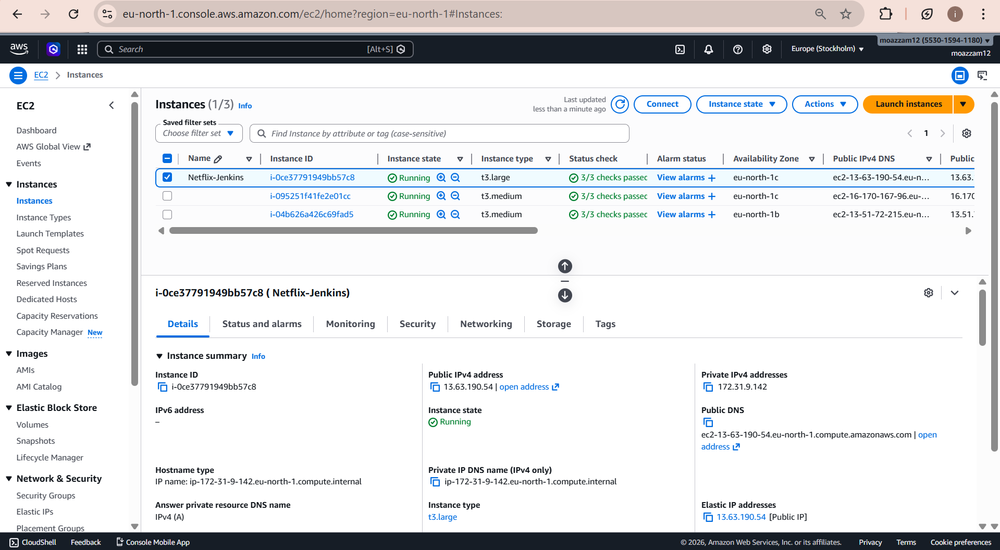

---

### Jenkins Pipeline — All Stages Green
> *Screenshot: Jenkins Netflix build showing all 10 stages passing*

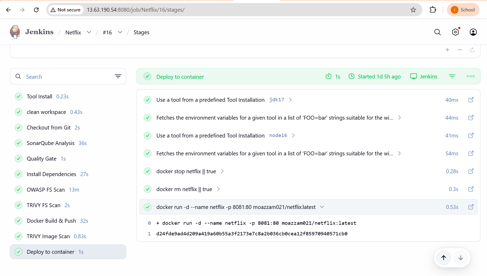

---

### SonarQube — Quality Gate Passed
> *Screenshot: SonarQube dashboard showing 0 bugs, 0 vulnerabilities, Quality Gate: PASSED*

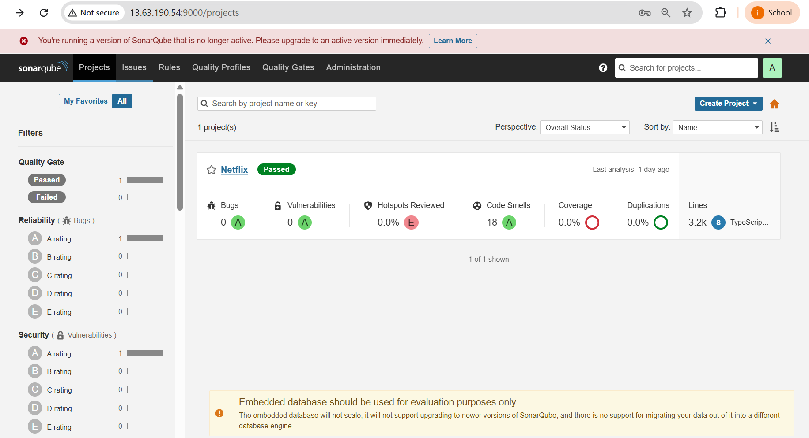

---

### Application Running on EC2 (Port 8081)
> *Screenshot: Netflix clone with movies loaded at http://13.63.190.54:8081*

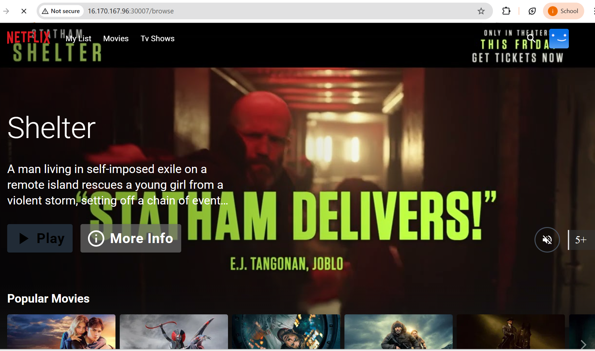

---

### AWS EKS — Node Groups Active
> *Screenshot: AWS EKS console showing the Netflix cluster node group with both t3.medium nodes in Active state*

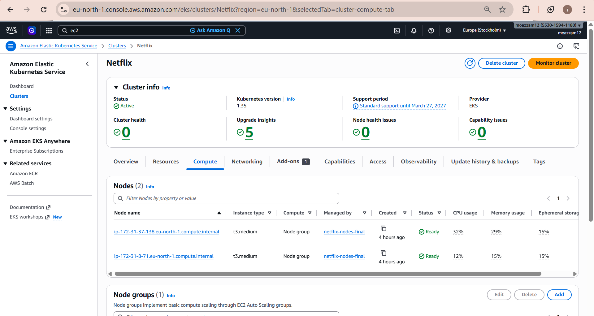

---

### ArgoCD — Netflix App Healthy & Synced
> *Screenshot: ArgoCD showing netflix application as Healthy + Synced*

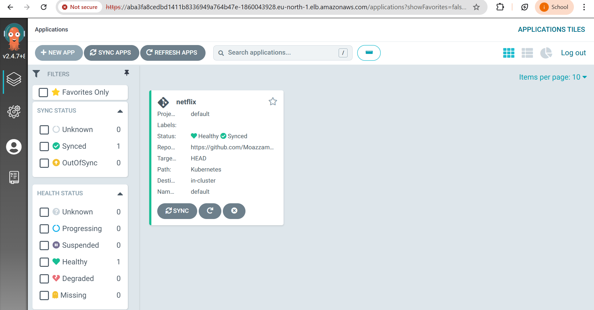

---

### Kubernetes Nodes — Both Ready
```bash
$ kubectl get nodes
NAME                                           STATUS   ROLES    AGE    VERSION
ip-172-31-37-138.eu-north-1.compute.internal   Ready    <none>   3h7m   v1.35.2-eks-f69f56f
ip-172-31-8-71.eu-north-1.compute.internal     Ready    <none>   3h7m   v1.35.2-eks-f69f56f
```

> *Screenshot: Terminal output confirming both EKS worker nodes in Ready state*

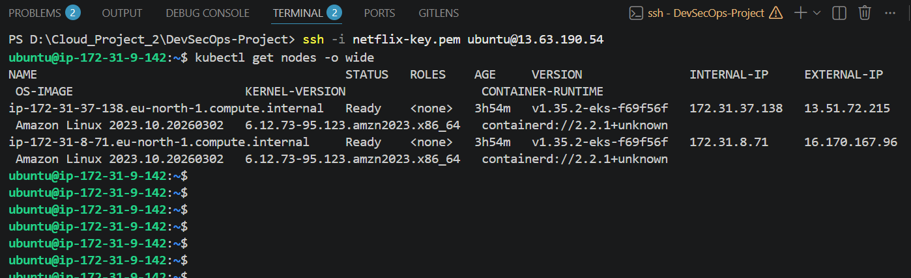

---

### Kubernetes Pods — All Running
> *Screenshot: Terminal output showing all Netflix application pods in Running state across both nodes*

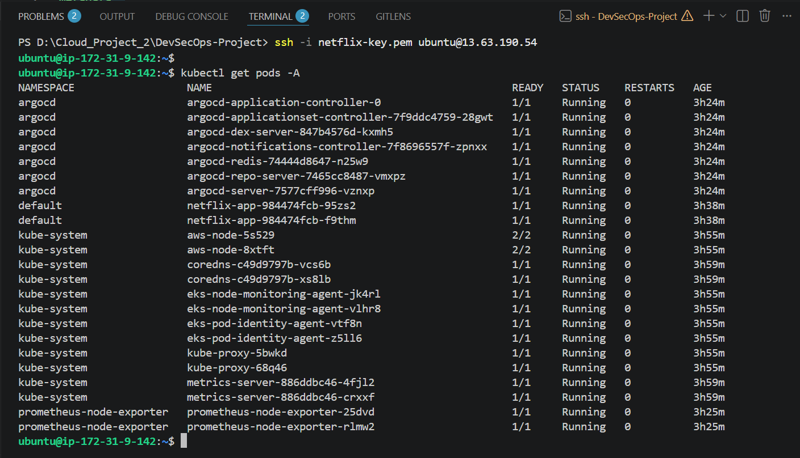

---

### Application Running on Kubernetes (Port 30007)
> *Screenshot: Netflix clone running via EKS NodePort at NodeIP:30007*


---

### Prometheus — All Targets UP
> *Screenshot: Prometheus targets page showing Jenkins, Node Exporter, Prometheus, EKS Nodes all green*

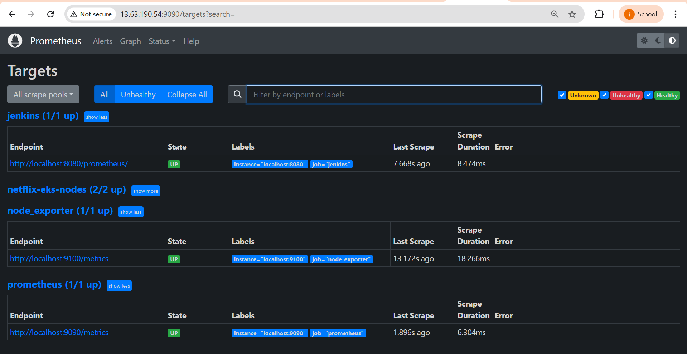

---

### Grafana — Node Exporter Dashboard
> *Screenshot: Grafana dashboard 1860 showing CPU, Memory, Disk, Network metrics*

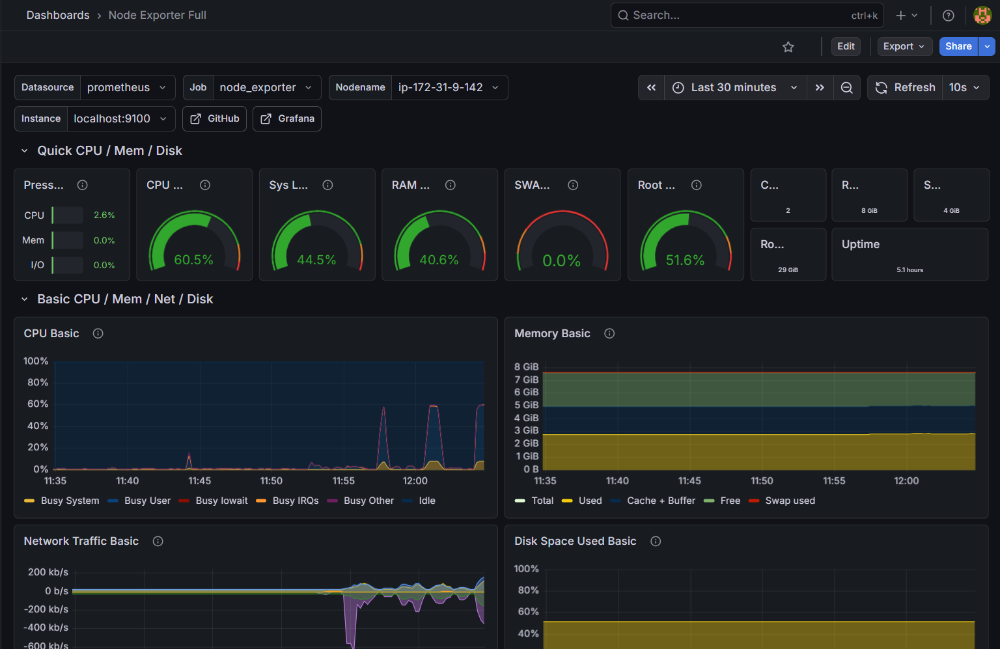

---

### Grafana — Jenkins Performance Dashboard
> *Screenshot: Jenkins performance dashboard showing build metrics, JVM memory, executor status*

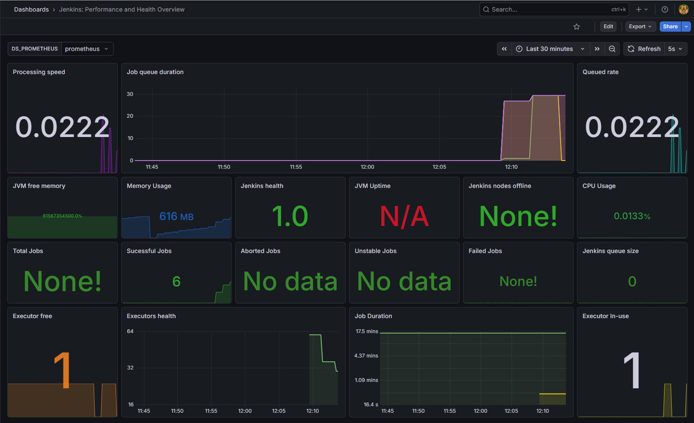

---

### DockerHub — Image Successfully Pushed
> *Screenshot: DockerHub moazzam021/netflix repository with latest tag*

> 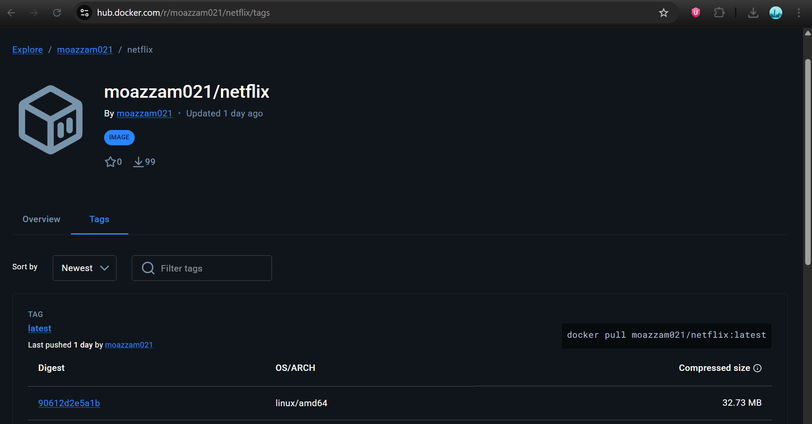


---

## 📊 Final Results

| Component | Status | Details |
|---|---|---|
| EC2 Instance | ✅ Running | t2.large, 8GB RAM, eu-north-1 |
| Jenkins Pipeline | ✅ Passing | 10 stages, all green |
| SonarQube | ✅ Passed | Quality Gate OK, 0 critical issues |
| OWASP Scan | ✅ Complete | NVD database v12.2, full scan |
| Trivy FS Scan | ✅ Complete | Filesystem scanned |
| Trivy Image Scan | ✅ Complete | Docker image scanned |
| Docker Image | ✅ Pushed | moazzam021/netflix:latest |
| App on EC2 | ✅ Live | http://13.63.190.54:8081 |
| EKS Cluster | ✅ Active | Netflix, K8s 1.31, eu-north-1 |
| EKS Nodes | ✅ Ready | 2x t3.medium nodes |
| ArgoCD | ✅ Healthy+Synced | GitOps deployment live |
| App on K8s | ✅ Live | NodeIP:30007 |
| Prometheus | ✅ Scraping | 4 targets all UP |
| Grafana | ✅ Dashboards live | Node Exporter + Jenkins |

**Project Completion: 100%** 🎉

---

## 🏁 Conclusion

This project successfully demonstrates a complete DevSecOps lifecycle — from a developer's laptop to a production Kubernetes cluster, with security integrated at every stage.

**What makes this project meaningful beyond the checkbox:**

The journey revealed that DevSecOps is not just about installing tools — it is about engineering resilience. Every challenge we faced (GPG failures, NVD API changes, EKS Auto Mode conflicts, RAM exhaustion) required understanding the root cause and building a durable solution. This is what separates engineers from tutorial followers.

**Key architectural insights gained:**

1. **Security depth matters** — scanning at code, dependency, and container levels catches fundamentally different classes of vulnerabilities
2. **GitOps creates auditability** — every deployment is traceable to a Git commit
3. **Observability is not optional** — without Prometheus and Grafana, we would have been debugging RAM issues blindly
4. **Infrastructure sizing is critical** — the entire project nearly failed due to running enterprise tools on a 2GB instance
5. **Cloud services evolve** — EKS Auto Mode, NVD API requirements, AL2023 bootstrapping — real-world infrastructure requires adaptability

The Netflix clone is now deployed, secured, monitored, and automatically updated whenever the Git repository changes. That is the promise of DevSecOps — and this project delivers it.

---

## 🗂️ Repository Structure

```
DevSecOps-Netflix-AWS-CICD-Pipeline_Cloud-Assignment02/
├── src/                    # React application source
├── public/                 # Static assets
├── Kubernetes/             # K8s manifests
│   ├── deployment.yaml     # Netflix app deployment (2 replicas)
│   ├── service.yaml        # NodePort service (port 30007)
│   └── node-exporter-svc.yaml  # Prometheus metrics service
├── Dockerfile              # Multi-stage build (Node → Nginx)
├── package.json            # Dependencies (build: vite build)
├── package-lock.json       # Lock file
└── README.md               # This file
```

---

## 🚀 Quick Start (Reproduce This Project)

```bash
# 1. Clone the repo
git clone https://github.com/MoazzamHafeez1093/DevSecOps-Netflix-AWS-CICD-Pipeline_Cloud-Assignment02.git

# 2. Build locally with your TMDB API key
docker build --build-arg TMDB_V3_API_KEY=<your-key> -t netflix .

# 3. Run locally
docker run -d -p 8081:80 netflix:latest

# 4. Open http://localhost:8081
```

---

<div align="center">

---

*Built with persistence, debugged with determination, deployed with pride.*

**Muhammad Moazzam Hafeez** — FAST NUCES Islamabad

[](https://github.com/MoazzamHafeez1093)

---

</div>
